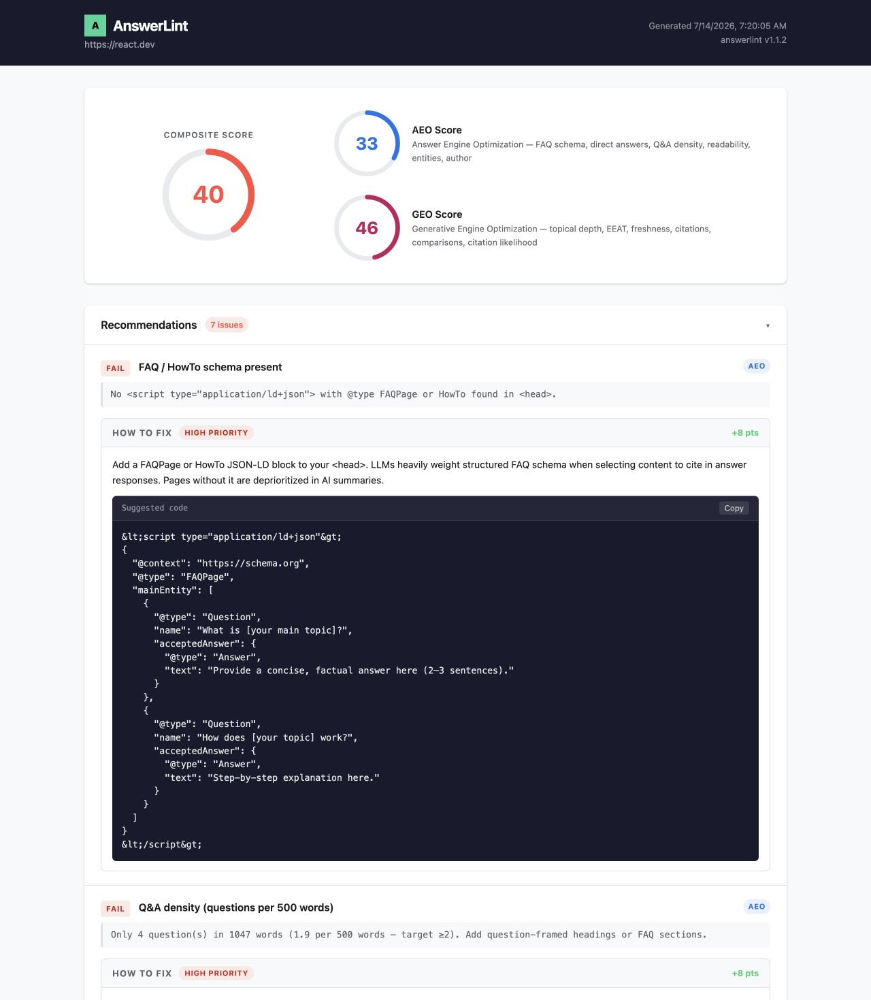

# llm-citeops

[](https://www.npmjs.com/package/llm-citeops)

`llm-citeops` is a CLI for auditing whether web content is ready for answer engines and generative search.

It helps teams answer a simple question:

**If this page is crawled, summarized, or cited by AI systems, is it actually ready?**

The package reads a page, runs a deterministic AEO and GEO rubric, computes weighted scores, and produces reports with evidence and suggested fixes.



## Why people use it

Good SEO does not automatically mean good AI visibility.

A page can rank, but still be weak when a model looks for:

- direct answers
- clear structure
- trust and authorship signals
- fresh metadata
- supporting citations
- comparison-friendly content

`llm-citeops` gives you one report that is useful to both sides of the team:

- business users get a simple score and a readable summary
- operators get evidence, failed checks, and concrete fixes

## What you get

The CLI currently provides:

- `llm-citeops overview`
- `llm-citeops info`
- `llm-citeops audit`

Inputs:

- URL
- local Markdown or HTML file
- local folder of content files
- sitemap or sitemap index

Outputs:

- HTML for human review
- JSON for automation
- CSV for batches

## What it checks

The current audit rubric contains 12 checks.

### AEO

- FAQ or HowTo schema
- direct answer in the first paragraph
- Q&A density
- readability
- named entities
- author byline

### GEO

- topical depth
- trust signals
- content freshness
- external citations
- comparison content
- citation likelihood

These checks are deterministic heuristics over parsed HTML and extracted text. The package does not use an LLM to decide whether a page passes.

## Try it quickly

Fastest way to understand the product:

- website and playground: [llm-citeops.vercel.app](https://llm-citeops.vercel.app/)
- npm package: [llm-citeops on npm](https://www.npmjs.com/package/llm-citeops)
- source code: [GitHub repo](https://github.com/rakeshcheekatimala/llm-citeops)

Run without installing globally:

```bash
npx llm-citeops overview
```

Install globally:

```bash
npm install -g llm-citeops
```

Audit one live page:

```bash
llm-citeops audit --url "https://example.com/docs/article" --output html --output-path ./report.html
```

Audit one local file:

```bash
llm-citeops audit --file ./examples/sample.html --output json --output-path ./report.json
```

Audit a folder:

```bash
llm-citeops audit --dir ./examples --output csv --output-path ./batch.csv
```

Audit a sitemap:

```bash
llm-citeops audit --sitemap "https://example.com/sitemap.xml" --output csv --output-path ./site.csv
```

## How it works

The workflow is intentionally simple:

1. Read content from a URL, file, folder, or sitemap
2. Normalize and parse the content
3. Run the AEO and GEO checks
4. Compute `aeo`, `geo`, and `composite` scores
5. Attach recommendations for failed or warning checks
6. Write a report in HTML, JSON, or CSV

The score bands are:

- `poor`
- `needs-improvement`
- `good`
- `excellent`

By default, AEO contributes `50%` and GEO contributes `50%` to the composite score.

## Best practices

Start with one page before running a folder or sitemap audit. It is much easier to validate the rubric and review the recommendations on a known page.

Use `html` when a person will read the report. Use `json` or `csv` when another tool will consume it.

Use `csv` for real batch runs. It is the only format that currently emits every page in a folder or sitemap audit.

Treat the score as a prioritization signal, not a guarantee. This package is designed to help you improve content quality systematically, not to promise ranking or citation outcomes.

If your site is heavily client-rendered, audit the rendered HTML output or local exports when possible. The current implementation does not run a browser.

Respect `robots.txt`, rate limits, and site terms when auditing third-party URLs.

## Command reference

```text
llm-citeops overview
llm-citeops info

llm-citeops audit [options]
  --url <url>
  --file <path>
  --dir <path>
  --sitemap <url>
  --output <format>     html | json | csv
  --output-path <path>
  --threshold <n>
  --ci
  --ignore-robots
  --depth <n>
  --rate <n>
  --config <path>
  --probe
  --models <list>
  --compare <url>
```

Current implementation notes:

- `--probe` exists, but probe mode is not implemented yet
- `--compare` exists, but compare mode is not implemented yet
- `--depth` is accepted, but the current crawler does not use it yet
- `html` and `json` currently write only the first report for folder and sitemap runs

## CI and configuration

Fail a run when the score drops below a threshold:

```bash
llm-citeops audit --url "$DEPLOY_URL" --ci --threshold 70 --output json --output-path ./citeops-report.json
```

Exit codes:

| Exit code | Meaning |
|-----------|---------|
| 0 | Success |
| 1 | CI failure |
| 2 | Crawl or runtime error |
| 3 | Invalid input or config |

Optional config loading order:

- `--config <path>`
- `.citeops.json` in the current project
- `.citeops.json` in the home directory

Example:

```json
{
  "audit": {
    "aeo_weight": 0.5,
    "geo_weight": 0.5,
    "custom_weights": {
      "faq_schema": 1.5,
      "direct_answer": 1.5,
      "citation_likelihood": 1.3
    }
  },
  "ci": {
    "threshold": 70,
    "fail_on_drop": true
  }
}
```

## Test it locally

```bash
git clone https://github.com/rakeshcheekatimala/llm-citeops.git
cd llm-citeops
npm install
npm run lint
npm run build
npm test
npm run test:coverage
```

Useful smoke tests:

```bash
node dist/index.js audit --file ./examples/sample.html --output html --output-path ./sample-report.html
node dist/index.js audit --file ./examples/sample.md --output json --output-path ./sample-report.json
node dist/index.js audit --dir ./examples --output csv --output-path ./examples-report.csv
```

Coverage artifacts are written to:

- [coverage/index.html](/Users/rakeshcheekatimala/Desktop/Learnings/llm-citeops/coverage/index.html)
- [coverage/report.md](/Users/rakeshcheekatimala/Desktop/Learnings/llm-citeops/coverage/report.md)
- [coverage/summary.json](/Users/rakeshcheekatimala/Desktop/Learnings/llm-citeops/coverage/summary.json)

## Releases

Releases are automated with `semantic-release` from `main`.

Version bumps follow conventional commits:

- `fix:` for patch releases
- `feat:` for minor releases
- `feat!:` or `BREAKING CHANGE:` for major releases

Preview the next version locally:

```bash
npm run release:dry-run
```

`semantic-release` itself requires Node 24 for the release step, so the local dry run uses an ephemeral Node 24 runtime even if day-to-day development stays on Node 18 or 20.

The release workflow runs typecheck, build, and tests, then publishes to npm and creates a GitHub release when the commit history since the last tag contains a releasable change.

## Project health

Latest verified local snapshot on `2026-04-10`:

| Metric | Status |
|---|---|
| Typecheck | `npm run lint` |
| Build | `npm run build` |
| Tests | `32/32` passing |
| Coverage | `95.06%` lines, `82.33%` branches, `89.07%` functions |
| Bundle size | `61,331 bytes` for `dist/index.js` |

## Docs

- [CONTRIBUTING.md](/Users/rakeshcheekatimala/Desktop/Learnings/llm-citeops/CONTRIBUTING.md)
- [docs/requirements.md](/Users/rakeshcheekatimala/Desktop/Learnings/llm-citeops/docs/requirements.md)
- [docs/suggestions.md](/Users/rakeshcheekatimala/Desktop/Learnings/llm-citeops/docs/suggestions.md)

## Limitations

Current known limits:

- no browser rendering for JavaScript-heavy pages
- no implemented probe workflow yet
- no implemented compare workflow yet
- no recursive local directory traversal
- no aggregated HTML or JSON output for multi-page batch runs

## License

MIT
