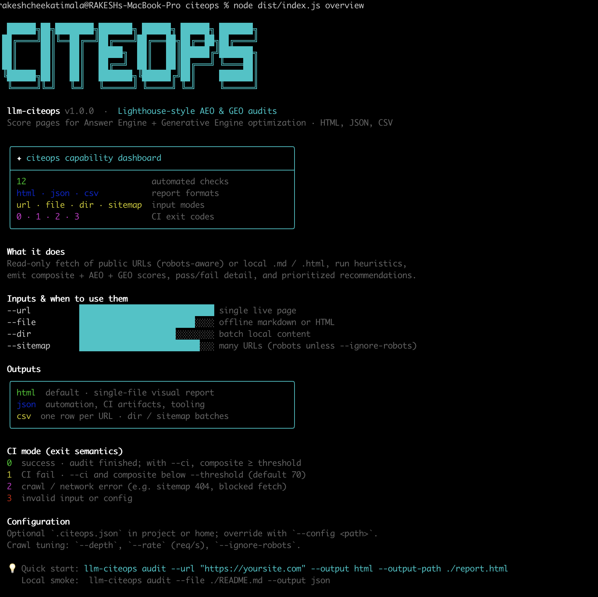

# llm-citeops

**llm-citeops** is a Lighthouse-inspired CLI that audits URLs and local files for **AEO** (Answer Engine Optimization) and **GEO** (Generative Engine Optimization). It scores checks, explains failures, and writes **HTML**, **JSON**, or **CSV** reports.

## Requirements

- **Node.js 18+**

## Install

```bash
npm install -g llm-citeops
```

Or run without a global install:

```bash
npx llm-citeops audit --help
```

## Capability dashboard (terminal)

See what the CLI can do in one screen—inputs, report formats, CI exit codes, and quick-start hints (similar spirit to `lean-ctx gain`):



```bash
llm-citeops overview
# or: llm-citeops info
```

## Quick start

```bash
# Audit a URL (quote URLs that contain &)
llm-citeops audit --url "https://example.com/docs/article" --output html --output-path ./report.html

# Audit a local Markdown or HTML file
llm-citeops audit --file ./content/post.md --output json --output-path ./report.json

# Audit every .md / .html in a folder
llm-citeops audit --dir ./content --output csv --output-path ./batch.csv

# Sitemap batch (respects robots.txt unless --ignore-robots)
llm-citeops audit --sitemap "https://example.com/sitemap.xml" --output csv --output-path ./site.csv
```

## Configuration

Optional project or home config: **`.citeops.json`** (see the example in this repo). Override path:

```bash
llm-citeops audit --url "https://example.com" --config ./my-citeops.json
```

## CI mode

Exit code **1** if the composite score is below the threshold:

```bash
llm-citeops audit --url "$DEPLOY_URL" --ci --threshold 70 --output json --output-path ./citeops-report.json
```

| Exit code | Meaning |
|-----------|---------|
| 0 | Success (CI pass if `--ci` and score ≥ threshold) |
| 1 | CI failure (score below threshold) |
| 2 | Crawl / network error |
| 3 | Invalid input or config |

## How to test (for contributors & pre-publish)

Clone the repo, install dependencies, typecheck, build, then run the CLI against a **local file** first (no network, stable).

```bash
git clone <your-repo-url> citeops
cd citeops
npm install
npm run lint          # TypeScript check (tsc --noEmit)
npm run build         # Produces dist/ for the published binary
```

### 1. Smoke test (local Markdown)

```bash
node dist/index.js audit --file ./README.md --output html --output-path ./test-report.html
open ./test-report.html   # macOS; or open in a browser manually
```

You should see a non-empty report with composite / AEO / GEO scores and audit sections.

### 2. Smoke test (JSON for automation)

```bash
node dist/index.js audit --file ./README.md --output json --output-path ./test-report.json
node -e "const r=require('./test-report.json'); console.log(r.scores, r.audits.length)"
```

### 3. Dev mode (no build)

```bash
npm run dev -- audit --file ./README.md --output json
```

### 4. Optional: live URL test

Some sites block simple HTTP clients (403/402/etc.). Prefer **documentation or blog URLs**, and always **quote** URLs that contain `&`:

```bash
node dist/index.js audit --url "https://developer.mozilla.org/en-US/docs/Web/JavaScript/Guide/Functions" --output html --output-path ./mdn-report.html
```

### 5. Before `npm publish`

1. Bump `version` in `package.json` if needed.
2. Run `npm run lint` and `npm run build`.
3. Dry-run the tarball:

   ```bash
   npm pack --dry-run
   ```

   Confirm **`dist/`** and **`templates/`** appear in the packed files.

4. Publish (with an npm account and OTP if 2FA is on):

   ```bash
   npm publish --access public
   ```

## Output formats

| Flag | Description |
|------|-------------|
| `--output html` | Single-file HTML report (default) |
| `--output json` | Machine-readable report |
| `--output csv` | Summary row per URL (useful for `--dir` / `--sitemap`) |

## Command reference

```text
llm-citeops overview   (alias: info) — terminal capability dashboard

llm-citeops audit [options]

  --url <url>           Single URL
  --file <path>         Local .md or .html
  --dir <path>          Directory of .md / .html
  --sitemap <url>       Crawl URLs from sitemap.xml

  --output <format>     html | json | csv (default: html)
  --output-path <path>  Write report to this path

  --threshold <n>       CI threshold (default: 70)
  --ci                  Exit 1 if composite < threshold

  --ignore-robots       Ignore robots.txt
  --depth <n>           Crawl depth (default: 1)
  --rate <n>            Requests per second (default: 1)
  --config <path>       Path to .citeops.json

  --probe               Reserved for future LLM probe mode
  --compare <url>       Reserved for future compare mode
```

## License

MIT

## Disclaimer

**llm-citeops** fetches public URLs read-only. Respect each site’s **robots.txt**, **terms of use**, and **rate limits**. You are responsible for compliant use. This tool does not imply endorsement by any third-party site used in examples or tests.

